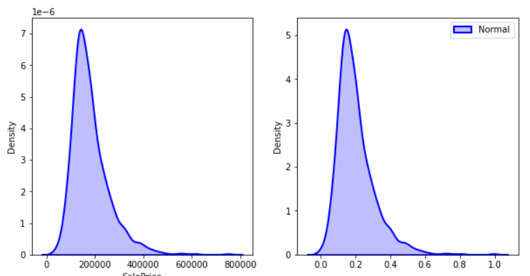
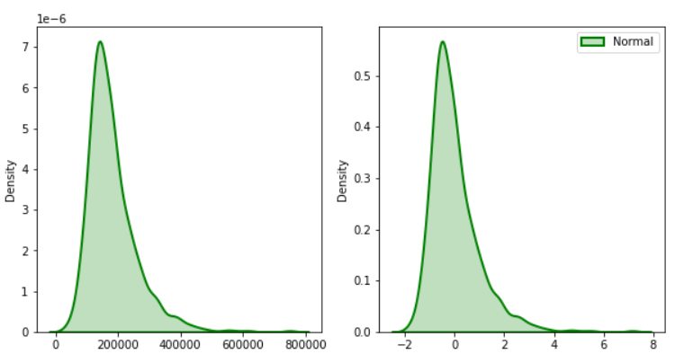
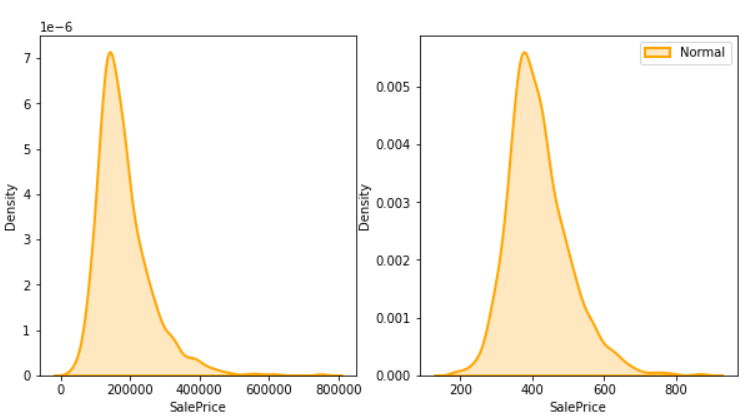
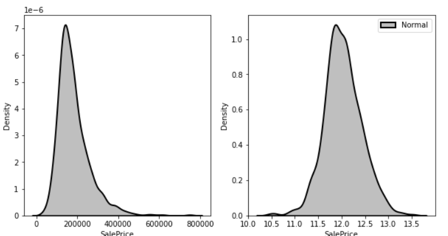
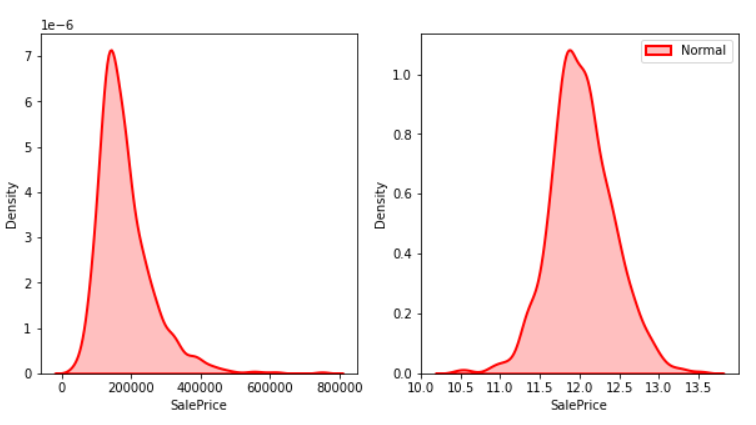
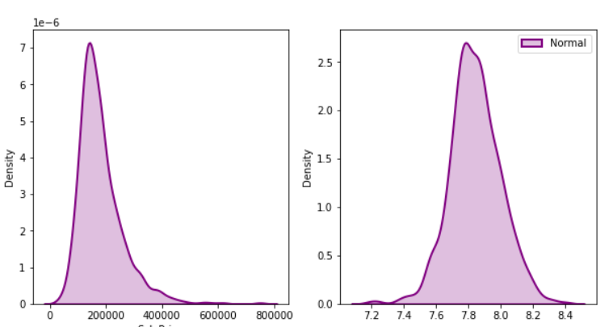

# Distribution-Analysis
Analysis of different distributions of a dataset and the effect of different normalization and standardization methods on them

## 🎯 Effect of MinMax method

## 🎯 Effect of StandardScaler method

## 🎯 Effect of sqrt/log1p/log method

## 🎯 Effect of Box Cox method

